もしこのフォルダの非公式立ち絵を利用されたい場合、動画素材用途でもその他の用途でも利用・改変いただけますが、元キャラクターの利用範囲・利用目的を遵守してください。私のクレジットの表記は任意です (表記される場合は「CookieBox26」「クッキー」などでどうぞ)。ずんだもん立ち絵は[東北ずん子ガイドライン](https://zunko.jp/guideline.html)に準拠します。各画像は修正・削除することがあります。

<table>
  <tr>
    <td>metan_00.png </td>
    <td>metan_01.png </td>
    <td>metan_10.png </td>
    <td>metan_11.png </td>
  </tr>
  <tr>
    <td>zundamon2_00.png </td>
    <td>zundamon2_01.png 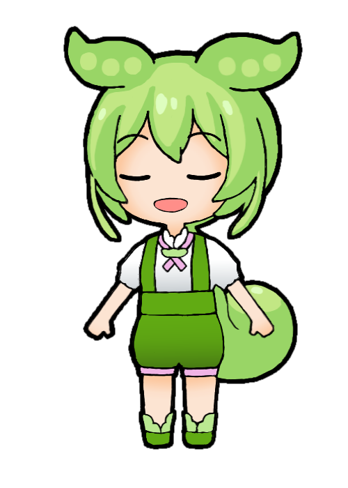</td>
    <td>zundamon2_10.png </td>
    <td>zundamon2_11.png 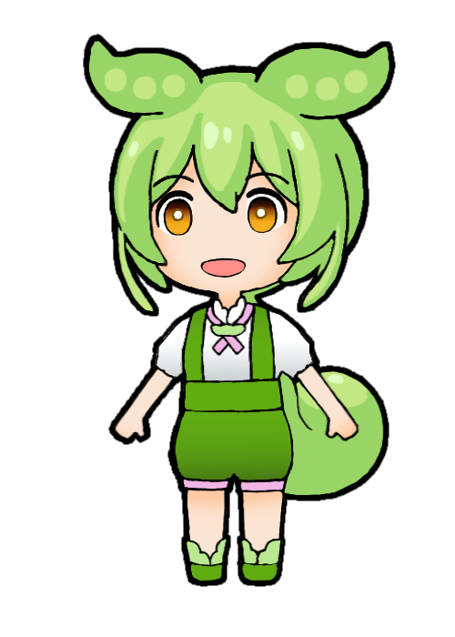</td>
  </tr>
  <tr>
    <td>zundamon2_20.png 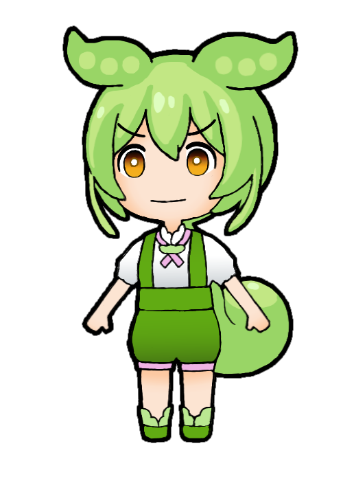</td>
    <td>zundamon2_21.png 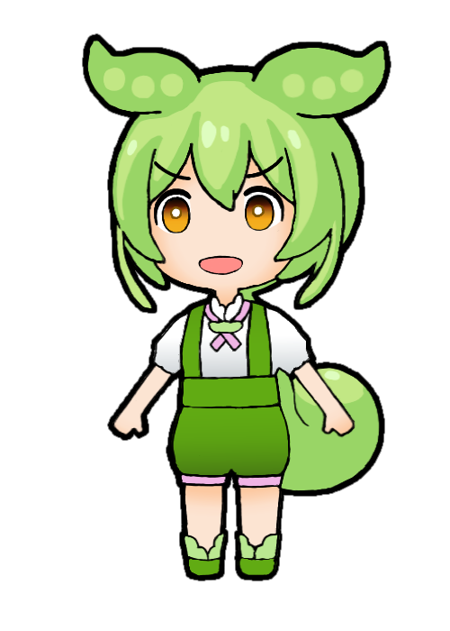</td>
    <td>zundamon2_30.png 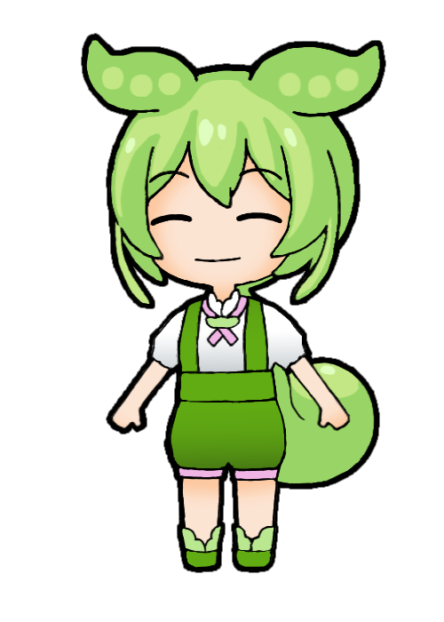</td>
    <td></td>
  </tr>
  <tr>
    <td>tsumugi2_00.png </td>
    <td>tsumugi2_01.png 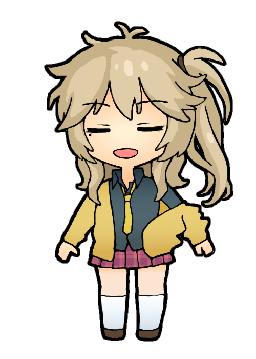</td>
    <td>tsumugi2_10.png </td>
    <td>tsumugi2_11.png 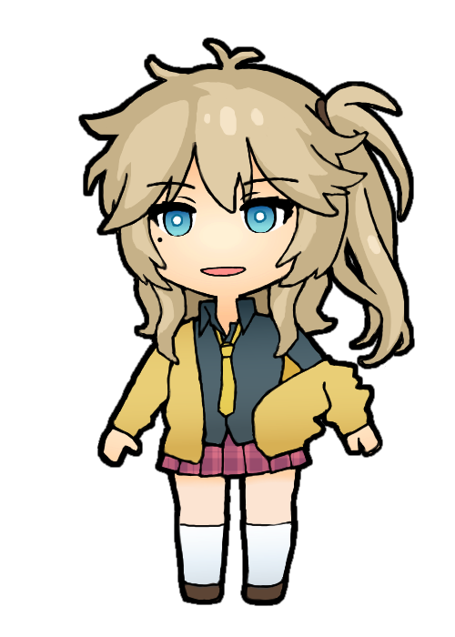</td>
  </tr>
  <tr>
    <td>kotaro_10.png 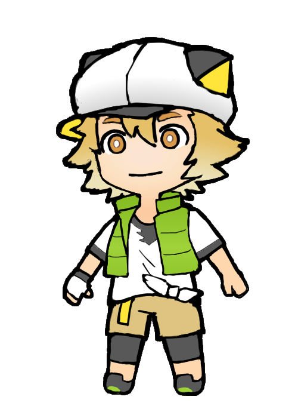</td>
    <td>kotaro_11.png </td>
    <td></td>
    <td></td>
  </tr>
  <tr>
    <td>himari_00.png </td>
    <td>himari_01.png </td>
    <td>himari_10.png 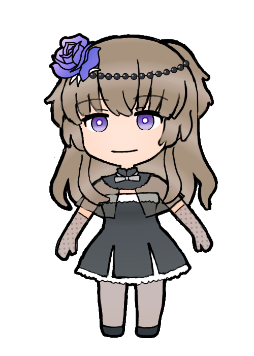</td>
    <td>himari_11.png 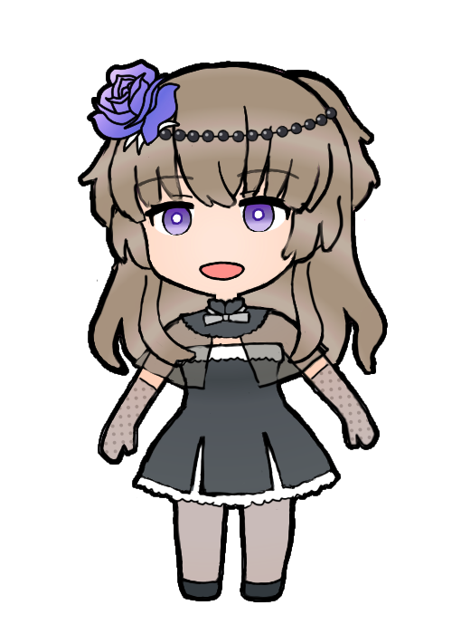</td>
  </tr>
  <tr>
    <td>whitecul2_10.png 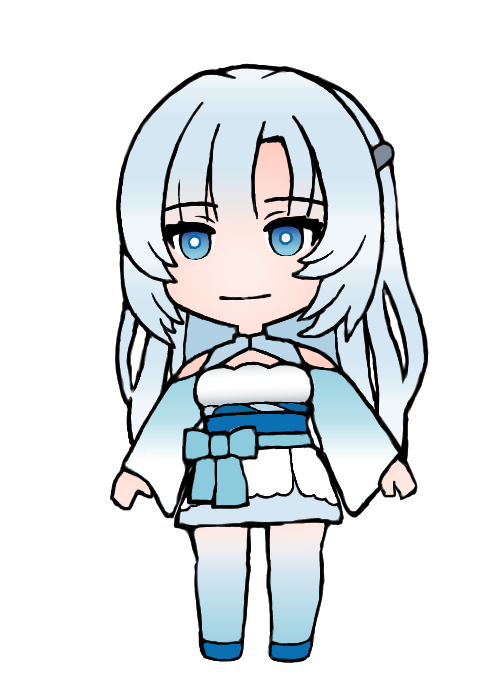</td>
    <td>whitecul2_11.png </td>
    <td></td>
    <td></td>
  </tr>
</table>

<table>
  <tr>
    <td>zundamon_00.png </td>
    <td>zundamon_01.png </td>
    <td>zundamon_10.png 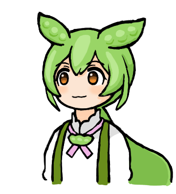</td>
    <td>zundamon_11.png 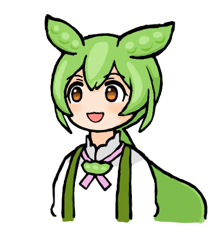</td>
  </tr>
  <tr>
    <td>zundamon_20.png </td>
    <td>zundamon_21.png </td>
    <td></td>
    <td></td>
  </tr>
  <tr>
    <td>tsumugi_00.png </td>
    <td>tsumugi_01.png </td>
    <td>tsumugi_10.png 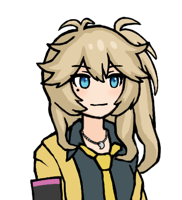</td>
    <td>tsumugi_11.png 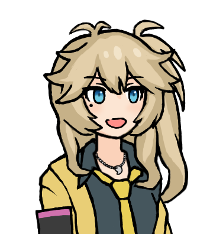</td>
  </tr>
  <tr>
    <td>tsumugi_20.png </td>
    <td>tsumugi_21.png </td>
    <td></td>
    <td></td>
  </tr>
  <tr>
    <td>whitecul_10.png 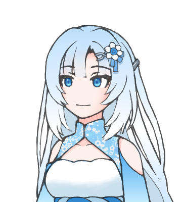</td>
    <td>whitecul_11.png </td>
    <td></td>
    <td></td>
  </tr>
</table>
